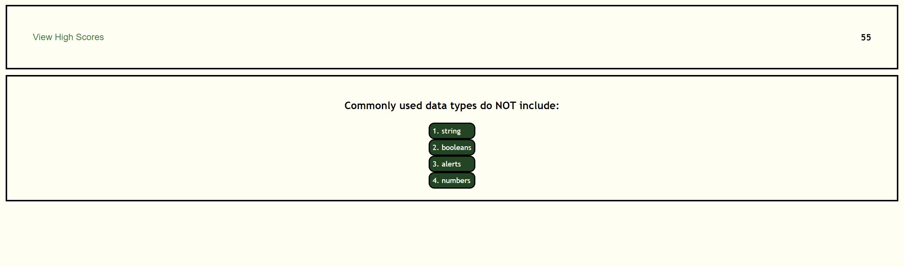
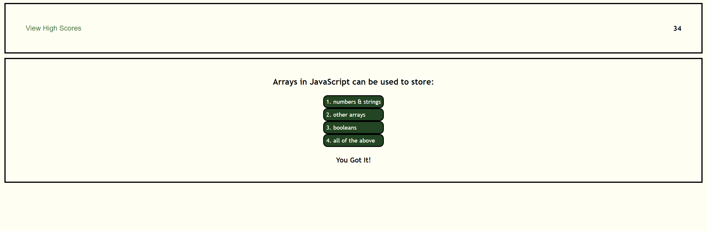
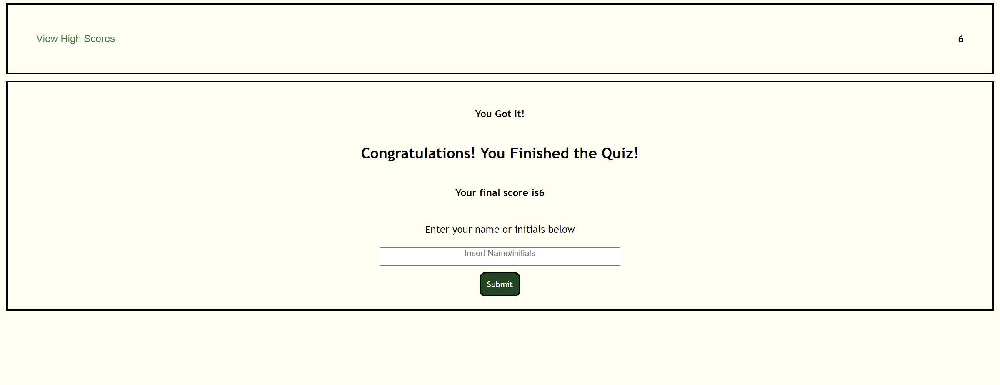

# Code Quiz

## Table of Contents
1. [Description](#description)
2. [Motivation](#motivation)
3. [Challenges](#challenges)
4. [Screenshots](#screenshots)
5. [Technologies Applied](#technologies-used)
6. [Future Development](#future-development)
7. [Contributors](#contributors)
8. [Links](#links)

## Description
The quiz created is to test the users knowledge of JavaScript and display their results afterwards. It also give the user the ability to clear the high score if they wish and restart the game to get a better score.

## Motivation
This was an bootcamp challenge that required us to test our abilities with HTML, CSS and JavaScript all together. The motivation behind this was to ensure that our skills in all these areas were proficient in creating a quiz that not only stores correct high scores in localStorage but also displays correct and incorrect answers to the player.

## Challenges
One of my biggest challenges with this assignment was near the end. After running through the application I noticed that the high scores were duplicating and not showing the result in the right order. 

Using the elements tab in dev tools, I realized that the `li` was not appended to the `ul` created in the HTML file. Once I appended the two together, the high scores were no longer duplicated and displayed the results in the correct order! 

Going forward, I know I need to use the dev tools more often to help me debug issues that arise throughout my coding career.

## Screenshots

Below are screenshots of each page of the application

## Technologies Used
* HTML
* CSS
* JavaScript

## Future Development
* Use a database to store user data instead of localStorage
* Change the quiz topic and add more questions
* Add more animation for a more exciting user experience
* Give a high score with two variables, time and accuracy
* More enhanced styling for a better user experience

## Contributors
I'm proud to say that I am the sole contributor of this project

## Links
* **[Repository](https://maggiejoe.github.io/code-quiz/)**
* **[Live App](https://github.com/maggiejoe/code-quiz.git)**