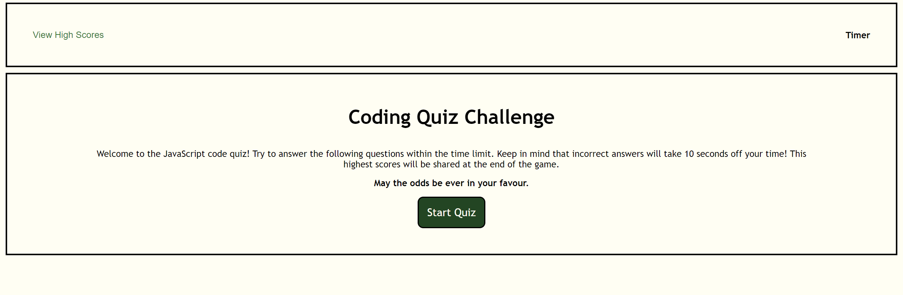

# Code Quiz

## Description

The quiz created is to test the users knowledge of JavaScript and display their results afterwards. It also give the user the ability to clear the high score if they wish and restart the game to get a better score.

## Challenges

One of my biggest challenges with this assignment was near the end. After running through the application I noticed that the high scores were duplicating and not showing the result in the right order. 

Using the elements tab in dev tools, I realized that the `li` was not appended to the `ul` created in the HTML file. Once I appended the two together, the high scores were no longer duplicated and displayed the results in the correct order! 

Going forward, I know I need to use the dev tools more often to help me debug issues that arise throughout my coding career.

## Deployment Link

Click [here](https://maggiejoe.github.io/code-quiz/) to view the deployable link!
Click [here](https://github.com/maggiejoe/code-quiz.git) to view my github repo!

## Screenshots

Below are screenshots of each page of the application

# Challenge #4 Criteria

## Technical Acceptance
* ✅ At the beginning of the quiz, a timer begins when the `Start Quiz` button is clicked on
* ✅ When the question is answered, the next question is presented
* ✅ If the question is answered wrong, time is taken off the timer
* ✅ When all questions have been answered, the timer stops the user sees their score and has the ability to save their score
* ✅ Once the user has saved their score, they are presented with a page that displays all high scores saved on the local device

## Deployment

* ✅ Application Deploys @ live URL
* ✅ Application loads error free
* ✅ GitHub URL submitted
* ✅ GitHub repo contains application code

## Application Quality

* ✅ User experience is intuitive and easy to navigate
* ✅ UI style is clean and polished
* ✅ Application resembles the mock-up functionality provided in the instructions

## Repository Quality
* ✅ Repo has unique name
* ✅ Repo follows best practices for file structure & naming conventions
* ✅ Repo follows best practices for class/id naming, indentation, quality comments...etc
* ✅ Repo has multiple commit messages
* ✅ Repo has quality README file with descriptions, screenshots & a link to deploy application